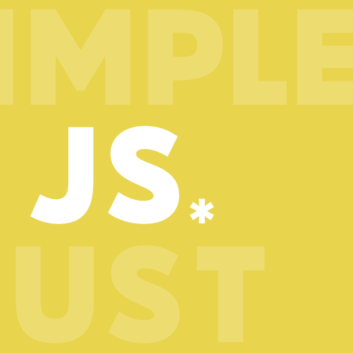

---

# Just Simple.

[@jswildcards](https://github.com/jswildcards)

---

Hi there :wave:

I am a University student, studying Computer Science as my main subject. 

#### Interest & Skills
- I love coding :smiling_face_with_three_hearts:
- My favourite language is JavaScript
- I can write Node.js and Vue
- I am learning Deno, React and React Native

#### Projects
- I am doing [this](https://github.com/users/jswildcards/projects/1) for my final year project

#### Side-projects
- [Minesweeper](https://jswildcards.github.io/game/minesweeper/demo) (Implementing) :hammer:
